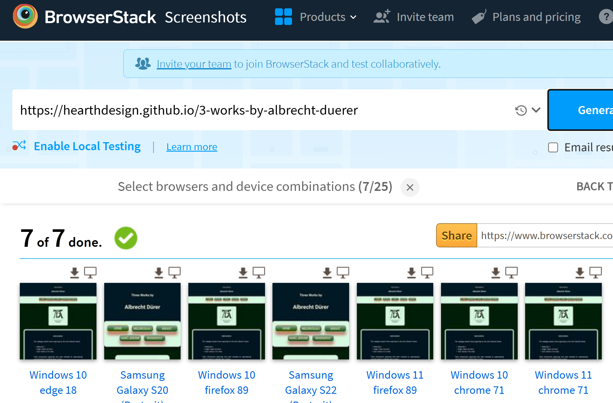
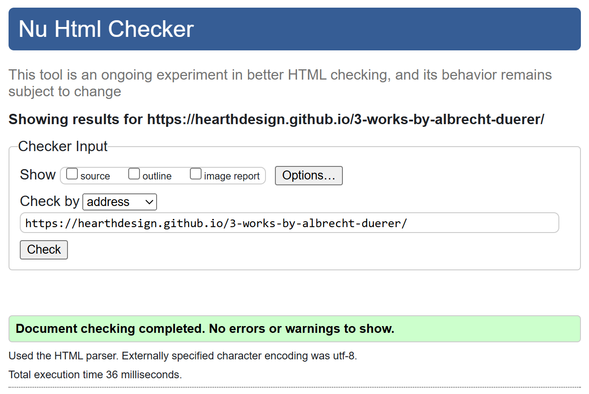

# Three Works by Albrecht Dürer
---
This website presents three engravings by the German Renaissance master Albrecht Dürer (1471–1528). Designed to engage audiences of all ages, the site offers an interactive, multimedia experience that brings these classic works to life.

---


---
## Instructions
---


User Stories:

- As an art student, or a casual visitor, I can appreciate artist's work
  in an interactive way.
- As an art teacher I can use the representations to introduce students 
  to Renaissance symbolism.
- As a developer, I want to present content in an accessible and responsive way.
- As a designer, I want to enhance the engagement with antique prints.

---
## Features
---
### Interactive Colourization and Animation
To create a more immersive experience, I used Photoshop to partially colourise some details of the black-and-white engravings. I then incorporated HTML and CSS animations, primarily using of the :hover pseudo-class and manipulating of the z-axis.

When users move their cursor over specific areas of the image, coloured versions of some figures and  accompanying text overlays appears, bringing new depth to the static artwork.

The colourization separates individual fragments of the detailed artwork from the rest, accentuating both the element and its background. This playful effect encourages userd to spend time on the image, thereby increasing the liklyhood that they will notice other elements of the composition.

---


---


---
### Emotional Soundscapes
To further enhance the atmosphere, I developed a music player integrated directly into the website. The selected pieces aim to reflect the emotional tone of each artwork, adding a layer of sensory engagement to the viewing experience.

---
### External Connections & Contact Form
This project includes interactive elements that connect users with external platforms and provide a way to get in touch directly: 
#### Social Media Links.
 - The page features clickable icons that link to external social media profiles, such as Mastodon, Friendica and Pixelfed. NOTE: Pixelfed is still awaiting activation from the service provider. 
 - These links open in a new tab and allow users to explore related content or follow the creator. 
 - No personal data is collected through these links—they simply redirect to public profiles.

#### Contact Form
Users can fill out a simple contact form that includes:
 - Name field
 - Email field: for entering a valid email address
 - Message field: for writing a custom message or inquiry
The form is designed with accessibility and responsiveness in mind. It features contrast-rich colors for improved readability, a clearly defined layout with descriptive labels, and a simple, intuitive structure that guides users through the input process. The fields are generously spaced and styled for clarity, ensuring ease of use across devices and screen sizes. Responsive design principles allow the form to adapt seamlessly to mobile, tablet, and desktop environments, while semantic HTML elements and keyboard-friendly navigation enhance usability for all users, including those relying on assistive technologies.

---
## Accessibility
---
The website is built with semantic HTML elements, improving both accessibility and searchability. The colour palette is vivid and high-contrast to ensure visibility for a wide range of users.

A fixed navigation menu appears at the top of every page. The menu contains animated buttons that respond to user actions by changing colour and size, making navigation intuitive and visually engaging.
---


---


---
## Design choices
--- 
The page is designed to showcase the works in the style of a museum or art gallery. To achieve this, the page is kept minimal, leaving plenty of space around the images to allow the viewer to focus on them. As the works are in shades of white and grey, the background colours are dark tones of green and blue, which aim to create a neutral yet elegant impression to complement these worthy artworks.

---
## Technical Considerations
---
To ensure optimal performance and broad compatibility:
All images were resized and saved in PNG format instead of SVG, maintaining quality while supporting older browsers.

A universal typeface was chosen for consistency and reliability across platforms.
The layout employs flexbox, adaptive containers, and percentage-based dimensions to ensure excellent responsiveness on all screen sizes.


<div align="center">  </div>

---
## DEPLOYMENT
### How to View and Deploy This HTML/CSS Project
---
### View the Live Site
You can access the live version of this project via GitHub Pages:
To deploy this site, use this link: https://hearthdesign.github.io/3-works-by-albrecht-duerer/

No installation needed—just click and explore!

### Clone and Run Locally
If you'd like to run the project on your own machine:

 1. Clone the Repository
```bash
git clone https://github.com/hearthdesign/3-works-by-albrecht-duerer.git
```
 1. Navigate to the Project Folder
```bash
cd 3-works-by-albrecht-duerer
```

 1. Open index.html in Your Browser
 - You can double-click the index.html file
 - Or use a local server (recommended for better compatibility)

Using Python (if installed):
```
python -m http.server
```

Then visit http://localhost:8000 in your browser.

### Deploy Your Own Version on GitHub Pages
Deploy Your Own Version on GitHub Pages
If you want to fork and host your own version:

1. Fork the Repository 
 - Click the Fork button at the top-right of the GitHub page.

2. Enable GitHub Pages
 - Go to your forked repo’s Settings → Pages
 - Under Source, select the main branch and / (root) folder
 - Click Save

3. Access Your Site GitHub will generate a link like: 
https://yourusername.github.io/3-works-by-albrecht-duerer/

---
## Testing
---
The project has been tested on 9 different devices and 9 different browsers at [browserstack](https://www.browserstack.com/)


(not included in the picture, manually on the device Samsung S24 in the "Brave" browser)

This project passed the test on:
   - the HTML validator (http://validator.w3.org) with no error:
   
   - the jigsaw validator
<p>
    <a href="https://jigsaw.w3.org/css-validator/check/referer">
        
    </a>
</p>

<p>
    <a href="https://jigsaw.w3.org/css-validator/check/referer">
        
    </a>
</p>

Manually tested using the Google Developers tool and no errors were reported.


### Fixes:

Two errors have been encountered and adjusted on the html validator (at http://validator.w3.org):
   1. Innegal spacing in an image name:
   
   2. Missed opening <p> tag.

One error found and corrected on the CSS jigsaw validator (jigsaw.w3.org/css-validator):
   - invalid property name (font-style instead of font-weight) has been fixed.

#### Still to be fixed
No Bug detected.

---
## Future developments:

 - include the addition of more colourised images and texts.
 - Include images in the backgrounds of the 'Biography', 'Contact' and 'Copyright' pages, as well as  adding some interactive elements.

---
## Conclusion
---
This project combines classic art with modern web technologies to offer a dynamic reinterpretation of Dürer's engravings. By integrating visual interaction, sound, and responsive design, it invites users to explore historical works in a contemporary and accessible way.

---
## Disclaimer & Usage Conditions
---
### Music Usage
The music tracks featured on this website were legally purchased (from audiohero: https://www.audiohero.com/)  and are used here strictly for non-commercial, educational, and artistic purposes. I do not claim ownership over the original compositions, and I do not distribute, resell, or profit from their inclusion on this site.

If you are the copyright holder and have concerns regarding the use of your work, please feel free to contact me so we can promptly resolve any issues.

### Artwork and Colourization
The original engravings by Albrecht Dürer are in the public domain. However, the selective colourization and digital enhancements presented here are original artistic interpretations created by me.

These modified images are shared for educational, non-commercial display and interactive engagement. Please do not reproduce or distribute the altered images without appropriate credit or written permission.

### Educational Intent
This website was developed as an educational and creative project with the aim of introducing classical artworks to a broader audience through interactive design, music, and accessible commentary. No commercial activity is conducted through this platform.

### Main Works Referenced
The following engravings by Albrecht Dürer were used and referenced in this project. Textes from the same pages were used as well. For further information, please see their respective entries on Wikipedia:

Melencolia I
Wikipedia: https://en.wikipedia.org/wiki/Melencolia_I

Saint Jerome in His Study
Wikipedia: https://en.wikipedia.org/wiki/Saint_Jerome_in_His_Study

and:
https://www.metmuseum.org/art/collection/search/391259

Knight, Death and the Devil
Wikipedia: https://en.wikipedia.org/wiki/Knight,_Death_and_the_Devil

The four Horsemen
https://www.metmuseum.org/art/collection/search/336215

The Monogram:
https://commons.wikimedia.org/wiki/File:Albrecht_D%C3%BCrer_-_Monogramm.png

The text on the Biographys page:
https://www.metmuseum.org/essays/albrecht-durer-1471-1528?utm_source=chatgpt.com
---
---


